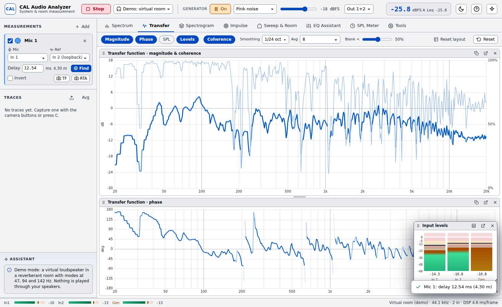

# CAL Audio Analyzer

A professional, real-time **sound system and room acoustics analyzer** that runs entirely in the browser. It sits in the same space as Smaart, REW and Open Sound Meter, with a focus on being approachable: a guided setup, a live assistant that explains what the data means, and a built-in virtual room so you can learn every feature without any hardware.


## Features

| Area | What you get |
| --- | --- |
| **Dual-channel transfer function** | Multi-time-window FFT (32k → 1k, constant ~1/48-octave resolution), magnitude, phase and coherence. Coherence blanking fades unreliable data. Averaging from none to 64 frames, or cumulative. Smoothing from 1/48 to 1/1 octave. |
| **Delay finder** | GCC-PHAT cross-correlation with sub-sample refinement, confidence estimate and polarity detection. Converts to distance using the air temperature. |
| **Internal or loopback reference** | Use the generator's own signal as the reference (works with any interface), or a hardware loopback for program-material measurements. |
| **RTA / spectrum** | True fractional-octave band power (pink noise reads flat) or narrowband FFT with peak picking. FFT sizes 4k–64k, peak hold, dBFS or calibrated dB SPL. |
| **Spectrogram** | Scrolling log-frequency spectrogram of any channel, with an adjustable range. |
| **Live impulse response** | Linear IR and energy-time curve from the averaged transfer function. One click sets the delay from the IR peak. Shows arrival time, distance and polarity. |
| **Sweep & room acoustics** | Exponential sweep (Farina) with synchronous averaging. Frequency response with selectable time windows (5 ms gated up to full). Harmonic distortion (H2, H3, THD). **ISO 3382** parameters per octave or 1/3 octave: EDT, T20, T30, C50, C80, D50 and centre time, using Lundeby noise-floor truncation and compensation. Fit-quality and INR indicators. Impulse response export as WAV. |
| **EQ Assistant** | Automatic parametric EQ against Flat, House, Tilt or X-curve targets. Prefers cuts, limits boosts and ignores low-coherence regions. Filters can be edited, the predicted result is shown, and filters export to Equalizer APO/REW text or CSV. |
| **SPL meter** | IEC 61672 A/C/Z weighting, Fast/Slow, Leq, Lmax, peak and a 2-minute history. Calibrates with a 94/114 dB calibrator or a reference meter. |
| **Traces** | Capture, overlay, offset, rename, spatially average (power average), and import/export CSV, REW and FRD text. Traces persist in the browser. |
| **Tools** | Mic calibration file loader (miniDSP/UMIK, Dayton, FRD), room mode calculator with Schroeder frequency and critical distance, delay/distance/wavelength calculator, and a weighting table. |
| **Spectrum & Transfer tabs** | Separate tabs for single-channel spectrum analysis (RTA/FFT) and the dual-channel transfer function (magnitude, coherence, phase). Each tab has its own panel layout, SPL meter and input level meters. |
| **Flexible workspace** | Every display on the Spectrum and Transfer tabs is a panel: the graphs, the SPL meter, and the input level meters (peak, RMS, peak hold and clip). Drag a title bar to rearrange panels and drag the splitters to resize them. Float a panel over the view, where you can move it and resize it from the corner, or detach it into its own window, for example on a second monitor. Closing a detached window docks the panel again. The layout is saved automatically, and *Reset layout* restores the default. |
| **Day / night modes** | Night mode is OLED black for dark venues. Day mode is a high-contrast light scheme for use in direct sunlight: a white background, black text, darker and more saturated traces, and thicker lines. Toggle it with the sun/moon button or **T**. |
| **Remote access** | The desktop app can host itself on your network. Phones, tablets and other computers open the app in any browser (scan the QR code, enter the PIN) and get **every tab, meter and function** with live data, including generator control and sweeps, while the audio interface stays on the host. |
| **Usability** | Setup wizard, a context-aware assistant (clipping, missing excitation, unset delay, low coherence, and so on), hover readouts with note name and wavelength, zoom and pan, keyboard shortcuts, and input/generator meters with clip indicators. |




## Desktop app (Windows, macOS, Linux)

CAL Audio Analyzer runs as a standalone desktop program. You don't need a browser, Node.js or a terminal to use it.

**Download:** open the repository's **Actions** tab → **Desktop app** → the latest run → **Artifacts**, and download the build for your system. Builds are also attached to **Releases** when a version tag is pushed.

| System | File | How to run |
| --- | --- | --- |
| Windows 10/11 | `CAL-Audio-Analyzer-…-win-x64.exe` (installer) | Run it and follow the setup. It adds Start-menu and desktop shortcuts. |
| Windows 10/11 | `CAL-Audio-Analyzer-…-portable.exe` | No install; just double-click it. |
| macOS | `…-mac-*.dmg` | Drag it to Applications. The build is unsigned, so right-click → Open the first time. |
| Linux | `…-linux-x86_64.AppImage` | `chmod +x` it, then run it. |

Windows SmartScreen may warn about an unrecognised app because the builds are not code-signed. Click **More info → Run anyway**.

**Build it yourself** (on the target OS):

```bash
npm install
npm run app          # build and launch the desktop app
npm run dist:win     # Windows installer + portable exe → release/
npm run dist:mac     # macOS dmg
npm run dist:linux   # Linux AppImage
```

The desktop app is Electron wrapping the same code as the web version. It serves the app from a secure `app://` origin, grants microphone access only to itself, and keeps measuring at full rate when its window is in the background. Settings and traces are stored in the app's own profile.

## Quick start (browser / development)

```bash
npm install
npm run dev        # open the printed URL (localhost is required for microphone access)
npm run app:dev    # same, but inside the desktop app window with hot reload
```

On first launch, choose **Explore with the demo room** to try everything with the built-in virtual loudspeaker and room. Nothing is played through your speakers. To measure a real system, choose **Measure a real system** and follow the wizard.

### Typical system-tuning workflow

1. Start audio and select your interface. Route **Out 1/2** to the system, put the measurement mic on **In 1**, and pick a reference: *Generator (internal)* or a loopback on *In 2*.
2. Turn on pink noise (Space) and raise the level until the mic reads 10–20 dB above the background.
3. Press **Find** (or `D`) to time-align the reference. Coherence should rise toward 100 %.
4. Capture traces (`C`) at several positions, select them and press **Avg** for a spatial average.
5. Open the **EQ Assistant**, pick the averaged trace and a target, then apply and verify the suggested filters.
6. For room acoustics, run a sweep in **Sweep & Room** to get RT60, EDT, clarity and definition per band.

### Keyboard shortcuts

| Key | Action |
| --- | --- |
| Enter | Start / stop audio |
| Space | Generator on/off |
| D | Find delay |
| C | Capture transfer function |
| R | Reset averages |
| P | Peak hold |
| F | Freeze display |
| 1–8 | Switch tabs |
| T | Day / night colour scheme |
| ? | Help |

## Remote access (tablet / phone / second computer)

Walk the room with a tablet while the analyzer and audio interface stay at the mix position.


1. On the computer with the audio interface, open the desktop app → **Tools → Remote access → Turn on remote access**.
2. Connect the remote device to **the same network**: the same Wi-Fi, or a hotspot from the host computer.
3. On the remote device, scan the QR code shown on the host, or open the address it lists (for example `http://192.168.1.20:8520/`) in Chrome, Safari, Edge or Firefox.
4. Enter the 6-digit **PIN** if asked. The QR link already includes it.

How it works: the host streams its live, sample-aligned audio (about 0.2 MB/s per input channel) to each remote device. The remote device runs the live analyzer on that stream, so every tab and meter works there. The host holds the shared session: sweeps started on any device run on the host, and their progress and results appear on every device (devices that join later get the latest result). Traces captured, renamed or deleted on any device are stored on the host and shown everywhere. Calibration, the mic correction, temperature and the measurement channel setup are shared the same way. View settings (tabs, smoothing, zoom, colour scheme) stay on each device.

- **PIN and control:** you can change the PIN at any time, remove it for open access, or turn off *Allow remote control* for view-only clients.
- **Firewall:** on Windows, allow CAL Audio Analyzer on *Private networks* when the firewall asks. Guest or venue Wi-Fi often isolates devices from each other; use a private network, a travel router or the laptop's hotspot instead.
- **Without the desktop app:** run `npm run build && npm run serve`, open `http://localhost:8520/host` on the host computer, and open the printed network address on the remote devices.

## Architecture

```
src/
  dsp/            Pure, unit-tested DSP (no DOM)
    fft.ts          radix-2 FFT with cached tables
    transfer.ts     multi-time-window dual-channel transfer function (H1, coherence)
    spectrum.ts     RTA / FFT spectrum (sine-referenced dBFS, band power)
    delay.ts        GCC-PHAT delay estimation
    sweep.ts        log sweep, regularised deconvolution, Farina harmonic distortion
    acoustics.ts    Schroeder/Lundeby decay analysis, ISO 3382 parameters, ETC, room modes
    weighting.ts    IEC 61672 A/C weighting (analytic + optimised IIR)
    spl.ts          sound level meter
    eq.ts           PEQ model and auto-EQ fitting
    calibration.ts  mic calibration file parsing
  audio/
    processor.ts    AudioWorklet: generator + sample-accurate multichannel capture
    simulator.ts    virtual loudspeaker + room for demo mode
    engine.ts       AudioContext, device handling, per-channel ring buffers
  views/          Spectrum, Transfer, Spectrogram, Impulse, Sweep & Room, EQ, SPL, Tools
  remote/         remote-access host link, remote engine and wire protocol
electron/         desktop main process, preload bridge and the remote-access hub (hub.cjs)
server/cli.mjs    standalone remote-access server for browser hosts
  ui/             canvas plot, spectrogram, dialogs, DOM helpers
```

Audio is captured in an AudioWorklet and written into per-channel ring buffers that are addressed by absolute sample index. That keeps every channel, including the internal generator reference, sample-aligned for dual-channel analysis. All processing happens locally, and audio never leaves the device.

## Testing

```bash
npm run check      # TypeScript + DSP unit tests (FFT, weighting, SPL, RTA, TF, delay, sweep, THD, RT60, EQ…)
npm run test:e2e   # builds, then drives the app in headless Chromium (demo room + fake mic) and verifies results
```

The end-to-end test checks that the delay finder recovers the virtual room's 12.5 ms propagation delay, that coherence is high after alignment, that the 47 Hz room mode appears in the transfer function, that the sweep's reverberation time is plausible, and that the hardware input path works.

## Browser notes

Works best in Chromium-based browsers (Chrome, Edge) and Firefox. Microphone access requires HTTPS or `localhost`. Multichannel interfaces expose as many input channels as the browser and driver allow. Echo cancellation, noise suppression and automatic gain control are disabled automatically for measurement accuracy.
