# CAL Audio Analyzer user guide

This guide explains how to measure and tune a sound system or a room with CAL Audio Analyzer. It is written for everyone, from first-time users to experienced system engineers. Each task has numbered steps, and technical words are explained in the [glossary](#glossary) at the end.

This guide is for version 1.10.

## Contents

1. [Before you start](#1-before-you-start)
2. [Install and open the app](#2-install-and-open-the-app)
3. [The screen at a glance](#3-the-screen-at-a-glance)
4. [Try the demo room](#4-try-the-demo-room)
5. [Connect your equipment](#5-connect-your-equipment)
6. [Set up and calibrate microphones](#6-set-up-and-calibrate-microphones)
7. [Measure the transfer function](#7-measure-the-transfer-function)
8. [Read the spectrum](#8-read-the-spectrum)
9. [Save and compare traces](#9-save-and-compare-traces)
10. [Tune with target curves and the EQ assistant](#10-tune-with-target-curves-and-the-eq-assistant)
11. [Align subs, fills and delay speakers](#11-align-subs-fills-and-delay-speakers)
12. [Measure a room with a sweep](#12-measure-a-room-with-a-sweep)
13. [Measure sound level and keep a noise log](#13-measure-sound-level-and-keep-a-noise-log)
14. [Use a phone or tablet as a remote](#14-use-a-phone-or-tablet-as-a-remote)
15. [Play music as the test signal](#15-play-music-as-the-test-signal)
16. [Workspaces, layout and settings](#16-workspaces-layout-and-settings)
17. [Save sessions and create reports](#17-save-sessions-and-create-reports)
18. [Accessibility](#18-accessibility)
19. [Keyboard shortcuts](#19-keyboard-shortcuts)
20. [Troubleshooting](#20-troubleshooting)
21. [Glossary](#glossary)

---

## 1. Before you start

**Protect your hearing and your loudspeakers.** The app can play test signals through your sound system.

- Always start with the amplifiers or the system level turned down.
- Raise the level slowly. You only need the test signal 10 to 20 dB louder than the background noise.
- Wear hearing protection when you measure at high levels.
- Never point a measurement microphone into a loudspeaker at close range at full level.

### What you need to measure a real system

- A computer with Windows 10 or 11, macOS, or Linux. You can also use the app in a browser such as Chrome, Edge or Firefox.
- An audio interface with at least one microphone input and one output.
- A measurement microphone. This is an omnidirectional microphone with a flat response, usually supplied with a calibration file.
- Optional: a sound level calibrator (94 dB or 114 dB) for accurate sound level readings.

You don't need any of this to learn the app. The [demo room](#4-try-the-demo-room) works without hardware and plays nothing through your speakers.

## 2. Install and open the app

Download the file for your system from the [latest release page](https://github.com/Audbol/CAL-Audio-Analyzer/releases/latest).

### Windows

1. Download `CAL-Audio-Analyzer-…-win-x64.exe` to install the app, or `CAL-Audio-Analyzer-…-portable.exe` to run it without installing.
2. Open the file. If Windows shows "Windows protected your PC", select **More info**, then **Run anyway**. This message appears because the app is not code-signed yet.
3. Follow the setup steps. The installer adds shortcuts to the Start menu and the desktop.

### macOS

1. Download the `.dmg` file for your Mac: `mac-arm64` for Apple Silicon (M1 and later), `mac-x64` for Intel.
2. Open the file and drag **CAL Audio Analyzer** to the **Applications** folder.
3. The first time, right-click (or Control-click) the app and choose **Open**, then **Open** again.
4. If macOS says the app "is damaged", open Terminal and run:
   `xattr -dr com.apple.quarantine "/Applications/CAL Audio Analyzer.app"`

### Linux

1. Download the `.AppImage` file: `x86_64` for most computers, `arm64` for ARM computers such as the Raspberry Pi 5.
2. Make it executable: `chmod +x CAL-Audio-Analyzer-*.AppImage`
3. Run it.

The first time the app opens, it shows a welcome window.

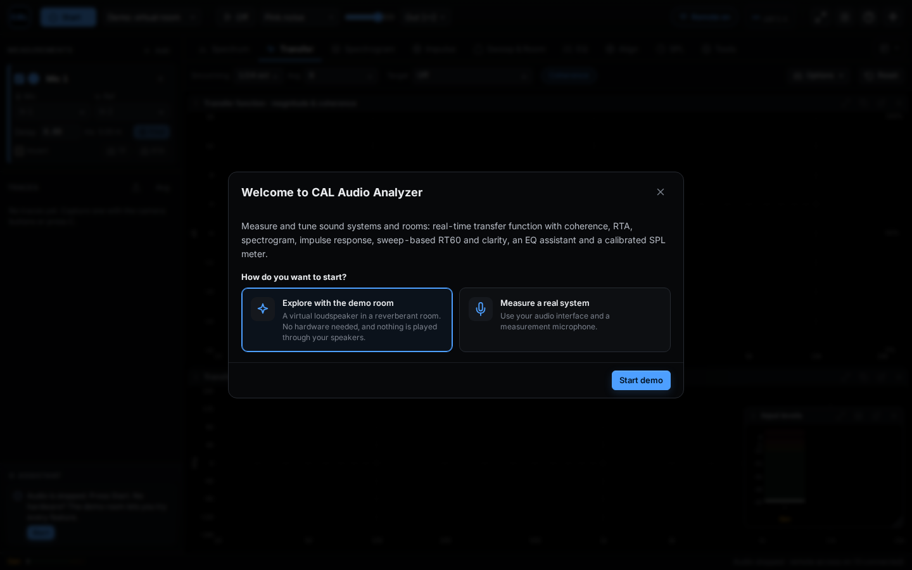

## 3. The screen at a glance

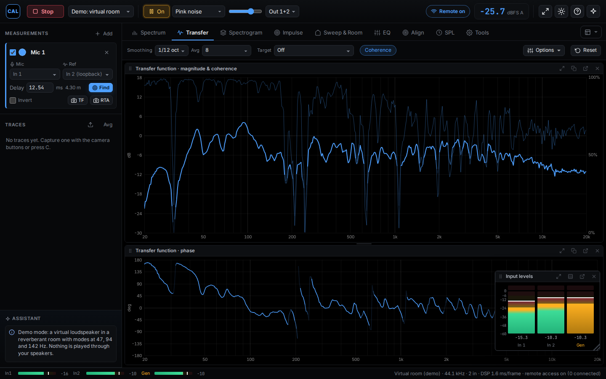

The window has five areas.

**Top bar**, from left to right:

- **Start / Stop** starts and stops audio. Shortcut: Enter.
- **Input source** chooses the audio interface, or the demo room.
- **Generator on/off** turns the test signal on and off. Shortcut: Space.
- **Signal type** chooses pink noise, white noise, sine, periodic sweep or music.
- **Level slider** sets the test signal level.
- **Outputs** chooses which outputs play the signal (for example Out 1+2).
- **Remote on** appears while phones and tablets can connect.
- **Sound level** shows the current level. Select it to open the SPL tab.
- On the right are buttons for full screen, day or night colours, help and the setup assistant.

**Tabs** below the top bar. Each tab is one tool. You can also press the number keys 1 to 9 to switch tabs.

| Key | Tab | What it does |
| --- | --- | --- |
| 1 | Spectrum | Shows how loud each frequency is (real-time analyzer). |
| 2 | Transfer | Compares the microphone with the signal sent to the system. |
| 3 | Spectrogram | Shows the spectrum over time as a colour picture. |
| 4 | Impulse | Shows when the sound arrives and how it decays. |
| 5 | Sweep & Room | Measures the room with a sweep: reverberation time and clarity. |
| 6 | EQ | Suggests equalizer settings. |
| 7 | Align | Times subs, fills and delay speakers to the main speakers. |
| 8 | SPL | Sound level meter and noise log. |
| 9 | Tools | Microphones, remote access, sessions, reports and settings. |

The **workspace** button sits at the right end of the tab row. See [Workspaces](#16-workspaces-layout-and-settings).

**Toolbar** below the tabs. It holds the everyday controls of the current tab. Less common settings are under **Options**.

**Sidebar** on the left:

- **Measurements**: each measurement microphone, its input, its reference and its delay.
- **Traces**: saved measurements you can show, hide and compare.
- **Assistant**: tips about what the app sees, for example clipping or low coherence.

On a phone, the sidebar opens from the menu button in the top-left corner.

**Status bar** along the bottom. It shows the input and generator level meters, the audio device, the sample rate, and whether battery saver or remote access is on.

## 4. Try the demo room

The demo room is a virtual loudspeaker in a reverberant room. It behaves like a real measurement, but nothing is played through your speakers.

1. In the welcome window, select **Explore with the demo room**.
2. Select **Start demo**.
3. The app starts pink noise, finds the delay, and opens the Transfer tab.

Every feature in this guide works in the demo room. To open the welcome window again later, select the setup assistant button at the right end of the top bar.

## 5. Connect your equipment

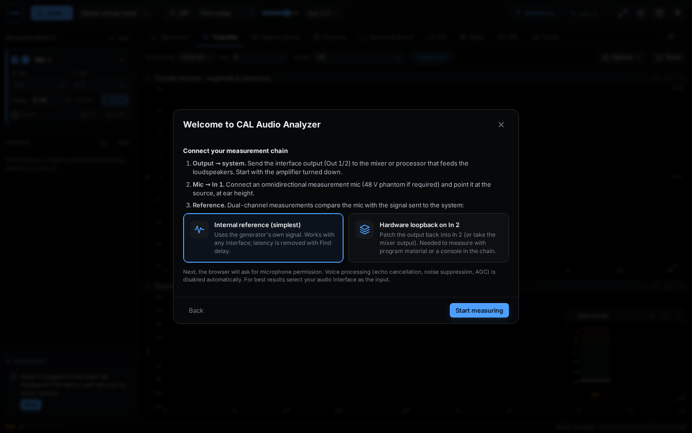

1. In the welcome window, select **Measure a real system**, then **Next**.
2. Connect the interface **output** (Out 1 and 2) to the mixer or processor that feeds the loudspeakers. Keep the amplifiers turned down.
3. Connect the **measurement microphone** to **In 1**. Turn on 48 V phantom power if the microphone needs it.
4. Place the microphone at ear height, pointing at the loudspeaker.
5. Choose a **reference**. The reference is the signal the app compares with the microphone.
   - **Internal reference (simplest):** the app uses its own test signal. This works with any interface.
   - **Hardware loopback on In 2:** connect an output (or the mixer output) back into In 2. Use this to measure with music or speech from a mixing console.
6. Select **Start measuring**. Your browser or system may ask for microphone permission. Allow it.
7. Choose your audio interface in the **input source** list in the top bar.

**Windows and ASIO:** the Windows app can use your interface's ASIO driver. Choose *ASIO: your interface name* as the input source. This gives you every channel and the lowest latency. Set the sample rate and buffer size in **Tools**, under **Audio interface (ASIO)**.

## 6. Set up and calibrate microphones

Set up each measurement microphone once. The app then reads every microphone correctly, even with different preamp gains.

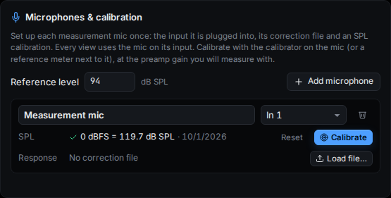

### Add a microphone

1. Open the **Tools** tab (press 9).
2. In **Microphones & calibration**, select **Add microphone**.
3. Type a name, for example "Front of house mic".
4. Choose the input it is plugged into, for example **In 1**.
5. If your microphone came with a calibration file, select **Load file…** and choose it. The app reads TXT, CAL, FRD and CSV files.

### Calibrate the sound level

1. Set the preamp gain to the value you will measure with. Don't change it after calibrating.
2. Put the calibrator on the microphone and switch it on.
3. Type the calibrator level in **Reference level**, usually 94 or 114 dB SPL.
4. Select **Calibrate** for that microphone.
5. The app confirms the calibration, for example "0 dBFS = 119.6 dB SPL".

No calibrator? Place a reference sound level meter next to the microphone, play pink noise, type the meter's reading as the reference level, and select **Calibrate**.

Without calibration, levels are shown in **dBFS** instead of **dB SPL**. That is fine for tuning, but not for sound level limits.

## 7. Measure the transfer function

The transfer function shows what the system does to the signal. It compares the microphone with the reference.

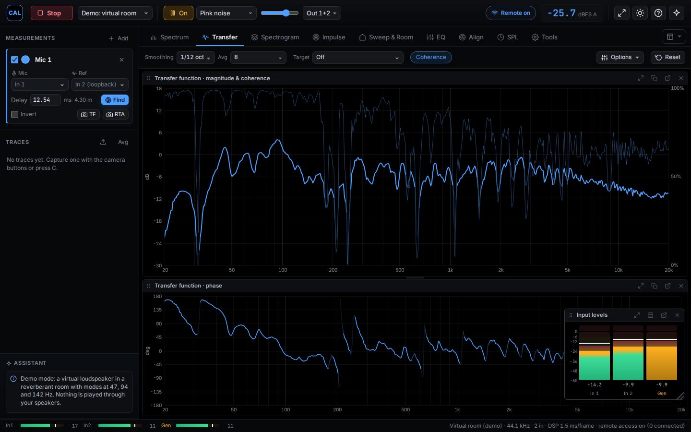

1. Start audio: select **Start** or press Enter.
2. Turn on the generator with pink noise: press Space.
3. Raise the level slowly until the microphone level is 10 to 20 dB above the background noise. Watch the In 1 meter in the status bar. It must not reach the top (clipping).
4. Select **Find** on the measurement card in the sidebar, or press D. The app measures the delay between the reference and the microphone.
5. Open the **Transfer** tab (press 2).

### How to read it

- **Magnitude** (top graph): how much louder or quieter each frequency is. A flat line means a neutral system.
- **Coherence** (thin line, scale on the right): how reliable the data is at each frequency. 100% is fully reliable. Where coherence is low, the data is faded, because noise or reflections are disturbing the measurement.
- **Phase** (bottom graph): the timing of each frequency. It matters when two speakers play the same frequencies, for example a sub and a main speaker.

### Useful controls

- **Smoothing** makes the curve easier to read. 1/12 or 1/6 octave is a good start.
- **Avg** sets how many measurements are averaged. More averaging gives a steadier curve that reacts more slowly.
- **Reset** (or R) restarts all averaging.
- **Coherence** shows or hides the coherence line.
- **Freeze** (F) stops the display so you can study it.

## 8. Read the spectrum

The spectrum, also called a real-time analyzer (RTA), shows how loud each frequency is at the microphone. It needs only the microphone, no reference.

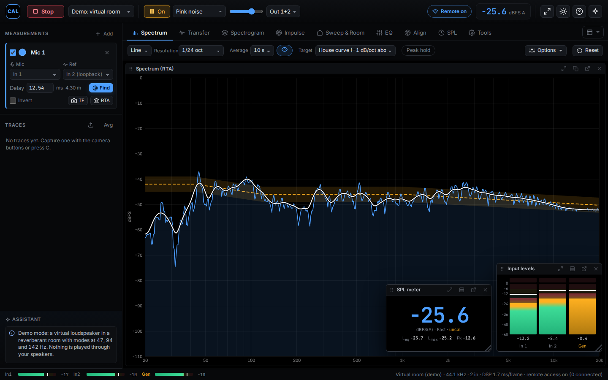

1. Open the **Spectrum** tab (press 1).
2. Choose **Line** or **Bars** (or press B). Bars show fractional-octave bands, for example 1/3 octave.
3. Choose the **Resolution**. 1/3 octave is easy to read, and 1/24 octave shows more detail.

### The average curve

The average curve is a smooth line showing the long-term tonal balance. It is useful for tuning to music.

- **Average** sets the time it covers: 1, 3, 10 or 30 seconds, or **All** (everything since the last reset).
- The **eye button** next to it hides or shows the curve. It keeps averaging while hidden.
- Under **Options**, in the **Average curve** section, you can choose its smoothing, colour and thickness.

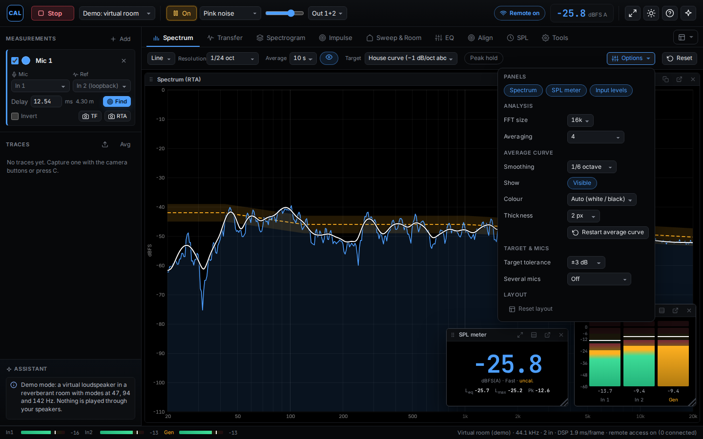

### Other displays

- **Peak hold** (P) keeps the highest level at each frequency.
- The **Spectrogram** tab (press 3) shows the spectrum over time. Frequency runs up the side, time runs from left to right with the newest data on the right, and colour shows level. **Layout** turns the picture the other way.
- The **Impulse** tab (press 4) shows the impulse response. **Set delay to peak** sets the delay from the strongest arrival.

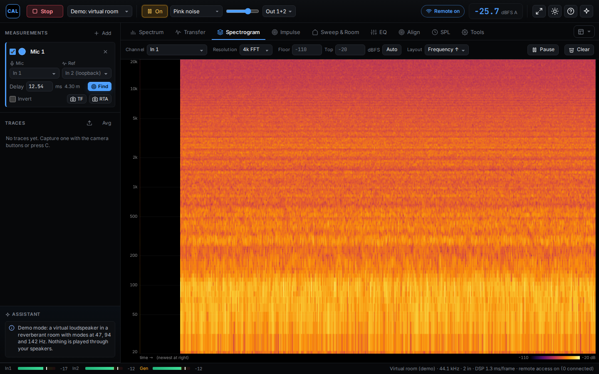

## 9. Save and compare traces

A trace is a saved measurement. Use traces to compare positions, or before and after a change.

1. To save the transfer function, press C, or select **TF** on the measurement card.
2. To save the spectrum, select **RTA** on the measurement card.
3. The trace appears in the **Traces** list in the sidebar.

In the Traces list you can:

- show or hide a trace,
- rename it, or move it up and down with an offset (in dB),
- add a note and a photo of the microphone position,
- export it as a CSV file, or delete it.

**Spatial average:** measure at several positions, tick the traces in the list, and select **Avg**. The app power-averages them into a new trace that represents the whole listening area.

**Import:** the upload button above the list imports measurements from CSV, FRD or text files.

## 10. Tune with target curves and the EQ assistant

### Show a target curve

A target is the response you want. The app draws it as a dashed line with a tolerance band, and levels it to your measurement automatically.

1. On the **Spectrum** or **Transfer** tab, choose a **Target**: Flat, House curve, Tilt, X-curve, or any saved trace.
2. Set the tolerance band under **Options**, then **Target tolerance**: ±1, 2, 3 or 6 dB.

### Let the app suggest EQ

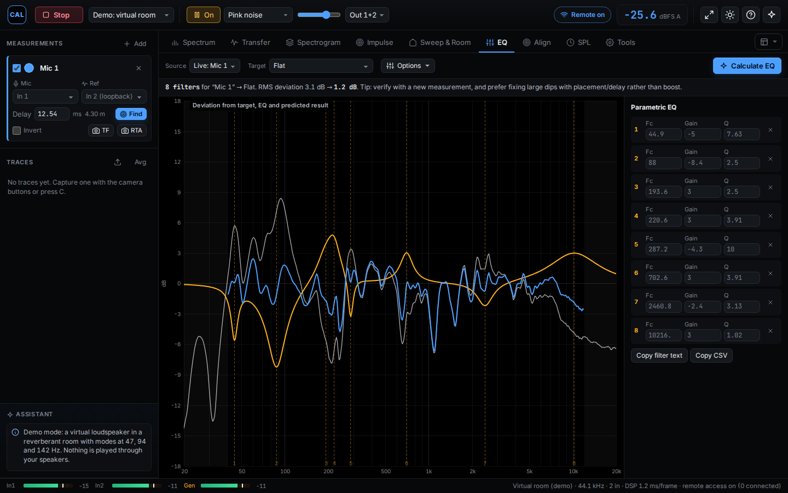

1. Measure at several positions and make a spatial average (see [Traces](#9-save-and-compare-traces)).
2. Open the **EQ** tab (press 6).
3. Choose the averaged trace as the **Source**, and choose a **Target**.
4. Select **Calculate EQ**.
5. The list on the right shows the suggested filters: frequency (Fc), gain and Q. You can edit each value.
6. Copy the filters with **Copy filter text** or **Copy CSV**, then enter them in your processor.
7. Measure again to check the result.

The assistant prefers cuts to boosts and ignores frequencies where coherence is low. Deep dips are usually caused by reflections or placement, and EQ can't fix them.

## 11. Align subs, fills and delay speakers

The **Align** tab works out the delay, polarity and level for every part of the system, so that each part arrives together with the main speakers.

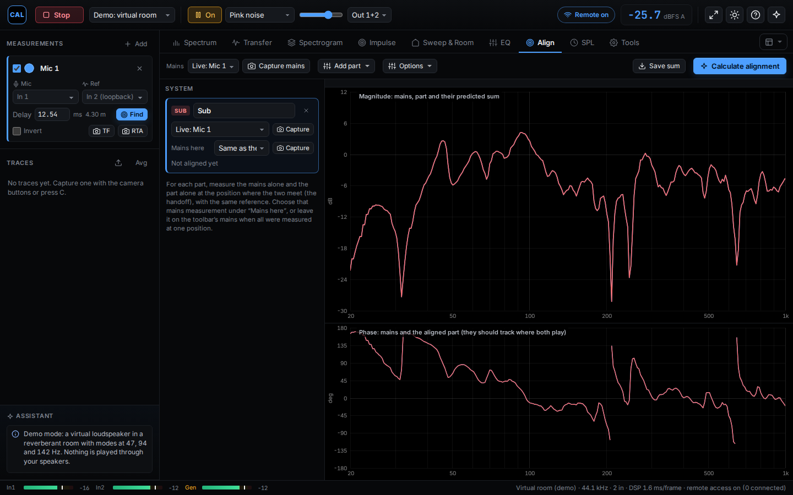

1. Open the **Align** tab (press 7).
2. Select **Add part** and choose the type: Sub, Front fill, Out fill, Delay speaker or Other speaker.
3. Place the microphone where the part and the main speakers meet. For a sub, that is a position where both play the crossover frequencies.
4. Play only the main speakers and select **Capture mains**.
5. Play only the part and select **Capture** on its card.
6. If each part meets the mains at a different place, capture the mains at each place with **Mains here**.
7. Select **Calculate alignment**.

The result shows, for each part:

- which side to delay, and by how much,
- the polarity (normal or inverted),
- the level compared with the mains,
- how well the two add up after alignment.

For fills and delay speakers, an optional **precedence** delay makes the sound appear to come from the stage. Apply the values in your processor and measure again.

## 12. Measure a room with a sweep

A sweep is a tone that glides from low to high frequencies. It measures the room's frequency response, distortion and reverberation precisely.

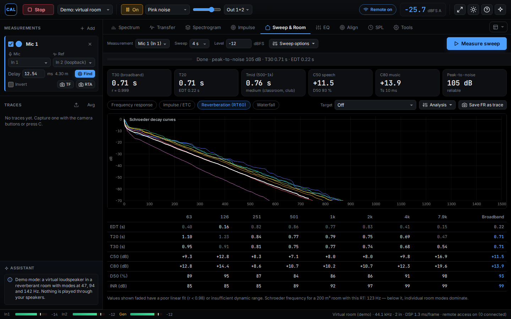

1. Open the **Sweep & Room** tab (press 5).
2. Choose the **Sweep** length. Longer sweeps give cleaner results in noisy rooms.
3. Set the **Level** in dBFS. Start low.
4. Ask everyone to be quiet, and select **Measure sweep**.
5. When the sweep has finished, the results appear:
   - **Frequency response** with distortion (H2, H3, THD),
   - **Impulse / ETC**,
   - **Reverberation (RT60)**: reverberation time, clarity and definition per octave or third-octave band,
   - **Waterfall**: how long each frequency keeps ringing.

**Show a target on the sweep result:** choose a **Target** next to the result tabs. This target is separate from the one on the Spectrum and Transfer tabs.

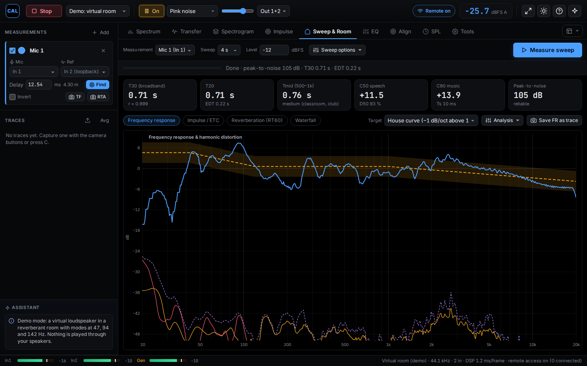

### Tips

- A **peak-to-noise** ratio of 40 dB or more gives reliable reverberation times. If it is lower, use a longer sweep, a higher level, or more repeats (under **Sweep options**).
- **Analysis**, then **FR window**, sets the time window for the frequency response. Short windows leave out room reflections and show the loudspeaker itself.

## 13. Measure sound level and keep a noise log

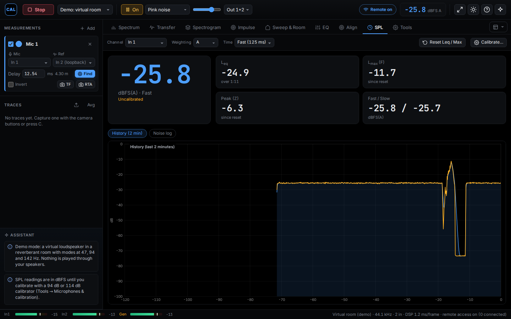

### Sound level meter

1. Open the **SPL** tab (press 8).
2. Choose the **Channel** (the microphone input).
3. Choose the **Weighting**: A for noise and hearing, C for loud music and bass, Z for flat.
4. Choose the **Time** weighting: Fast (125 ms) or Slow (1 s).
5. **Reset Leq / Max** starts the averages again.

The numbers update four times a second, so they are easy to read. Every value is computed from the audio itself and doesn't depend on the screen.

### Noise log

The noise log records the level for hours: one row per interval, with Leq, Lmax and the third-octave spectrum.

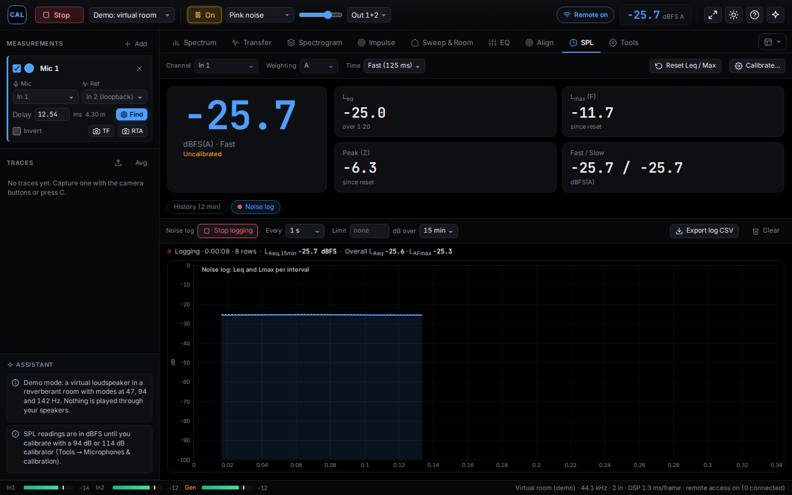

1. On the SPL tab, select **Noise log**.
2. Choose how often to log, under **Every**: 1 second to 15 minutes.
3. Optional: enter a **Limit**, for example 100 dB, and the time it is measured over, for example 15 minutes.
4. Select **Start logging**.
5. When the rolling level gets close to the limit, the level reading turns amber and shows a warning. Above the limit, it turns red and shows a warning. The colour is never the only signal: a written warning always appears too.
6. Select **Stop logging** when you are done.
7. Select **Export log CSV** to save the log as a spreadsheet file.

While the log runs, the weighting and the input are locked, so every row is measured the same way.

## 14. Use a phone or tablet as a remote

Walk around the venue with a phone or tablet while the computer and audio interface stay at the mix position. The phone shows every tab with live data.

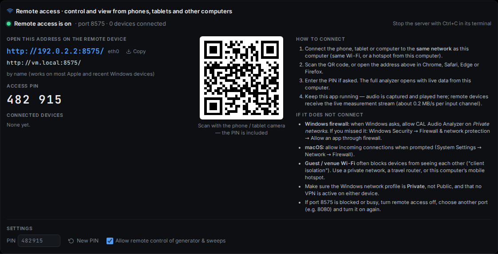

1. On the computer, open **Tools**, then **Remote access**, then select **Turn on remote access**.
2. Connect the phone or tablet to **the same network** as the computer.
3. Scan the QR code with the phone camera, or type the address shown into the phone's browser.
4. Enter the 6-digit PIN if asked. The QR code already includes it.

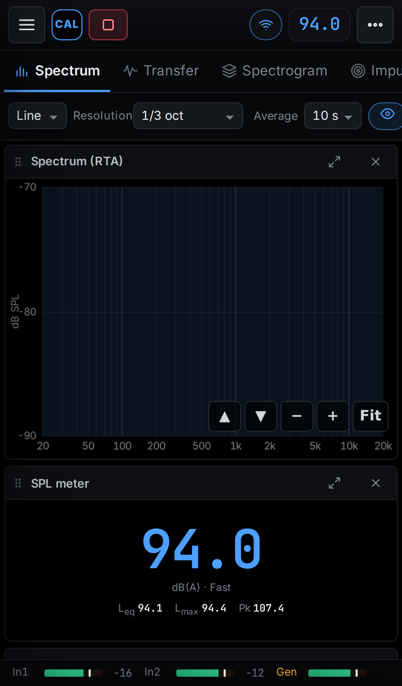

### If it doesn't connect

- On Windows, allow CAL Audio Analyzer on **Private networks** when the firewall asks.
- Guest and venue Wi-Fi often blocks devices from seeing each other. Use a private network, a travel router, or the computer's hotspot.
- Turn off VPNs on both devices.

Sweeps, traces, calibration and the target and average curves are shared between all devices. Each device keeps its own view settings, such as zoom and colours.

## 15. Play music as the test signal

You can measure with music instead of noise. This is useful during a sound check or a show.

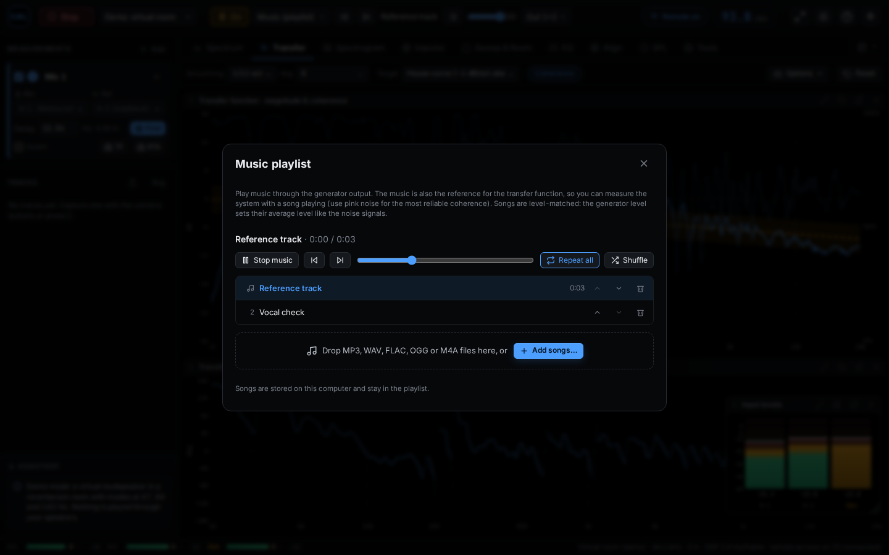

1. In the top bar, choose **Music (playlist)** as the signal type.
2. Select **Add songs…** and choose MP3, WAV, FLAC, OGG or M4A files.
3. Turn on the generator (Space).

The app uses the music itself as the reference, so the transfer function works while music plays. Measurements build up more slowly than with pink noise, because music doesn't contain every frequency all the time.

## 16. Workspaces, layout and settings

**Workspaces** set up the app for a job with one choice: the tab, the analysis settings, the display and the target.

1. Select the **workspace** button at the right end of the tab row.
2. Choose a workspace: Live mix, System tuning, Sub alignment, Voice system, Room survey or Noise monitoring.
3. To save your own setup, choose **Save current as workspace…** under **Manage** in the same list.

**Arrange the panels** on the Spectrum and Transfer tabs:

- Drag a panel's title bar to move it, and drag the line between panels to resize them.
- Each panel's title bar has buttons to float the panel over the view, open it in its own window (for example on a second monitor), or enlarge it.
- **Options**, then **Reset layout**, restores the default arrangement.

**Display & performance** (in Tools):

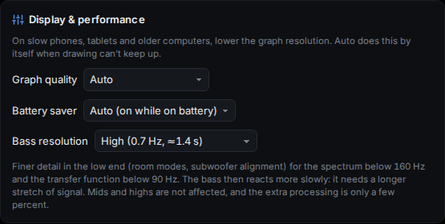

- **Graph quality:** lower it on slow devices.
- **Battery saver:** *Auto* turns it on while a laptop, tablet or phone runs on battery. It updates the screen less often and keeps every measurement exact.
- **Bass resolution:** *High* or *Maximum* shows more detail in the bass, but the bass reacts more slowly.

**Reset settings** (in Tools, under **Data**):

- **Reset analysis & display to** returns the analysis and display settings to the *App defaults* or to a *Classic dual-FFT* setup. Your microphones, calibrations, inputs, remote access and workspaces stay as they are.
- **Reset all settings** returns everything to the first start, including microphones and calibrations.

## 17. Save sessions and create reports

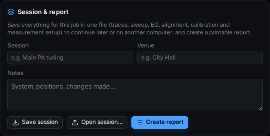

**Save a session.** A session holds the whole job: traces, the sweep result, EQ, alignment, the noise log, calibration and notes.

1. Open **Tools** and find **Session & report**.
2. Type the session name, the venue and any notes.
3. Select **Save session**. The app saves a `.calsession.json` file.
4. To continue later, or on another computer, select **Open session…**.

**Create a report.** Select **Create report**. The report opens in a new window with the setup, the measurements against the target, the room results, the EQ filters, the alignment plan and your notes. Print it, save it as PDF from the print window, or download it as HTML.

## 18. Accessibility

We want everyone to be able to use CAL Audio Analyzer. This section describes what works today and where the limits are.

### Keyboard

- Every button, list and input can be reached with the Tab key and used with Enter or Space.
- Shortcuts cover the most common actions. See [Keyboard shortcuts](#19-keyboard-shortcuts).
- Shortcuts don't fire while you type in a text field, or while a dialog is open.
- Escape closes dialogs and the Options panels.
- Focused controls show a visible focus ring.

### Seeing the screen

- **Day mode** (T, or the sun button) is a high-contrast light scheme with black text, darker colours and thicker lines. It is designed for direct sunlight and also helps with low vision.
- **Night mode** is a black scheme for dark venues.
- Use your system or browser zoom (Ctrl and +, or Cmd and + on a Mac) to make everything larger. The layout adapts to the window size.
- On phones and tablets, the graphs have large zoom buttons: up, down, minus, plus and **Fit**.
- Information is never shown by colour alone. Warnings always include text, and traces have names in the legend.

### Screen readers

- Every button, list and input has a name that screen readers read out, and dialogs are labelled.
- Messages are announced as they appear, and warnings straight away. New tips in the **Assistant** are announced too.
- Numbers are text: the SPL meter, the result cards, the reverberation table, the EQ filter list and the alignment plan.
- **Limit:** the graphs are drawn as images, so a screen reader can't read the curves. Use these text alternatives:
  - **Export CSV** on any trace gives every value as a table.
  - **Export log CSV** on the noise log.
  - **Create report** gives a structured document with the key figures.
  - The **Assistant** in the sidebar describes problems in words, for example low coherence or clipping.
- Reading values by hovering over a graph needs a mouse or touch.

### Hearing

- The app works visually. Alarms, such as the noise limit, are shown on screen and don't use sound.

If something stops you from using the app, please [open an issue](https://github.com/Audbol/CAL-Audio-Analyzer/issues) and describe what happened. Accessibility reports get priority.

## 19. Keyboard shortcuts

| Key | Action |
| --- | --- |
| Enter | Start or stop audio |
| Space | Generator on or off |
| 1 to 9 | Switch tabs (see [the tab list](#3-the-screen-at-a-glance)) |
| D | Find the delay of the first measurement |
| C | Save the transfer function as a trace |
| R | Reset averages |
| P | Peak hold on or off |
| B | Spectrum as line or bars |
| F | Freeze or unfreeze the display |
| T | Day or night colours |
| F11 | Full screen |
| ? | Help and shortcuts |
| Escape | Close a dialog or Options panel |

### Mouse and touch on graphs

- Hover to read the value, the note name and the wavelength.
- Scroll to zoom the level axis. Hold Shift or Ctrl while scrolling to zoom the frequency axis.
- Drag to move the view. Hold Shift while dragging to move along the frequency axis.
- Double-click to reset the zoom.

## 20. Troubleshooting

### No input level

- Check that the right interface is chosen as the input source.
- Allow microphone access when the system asks. On macOS, check System Settings, then Privacy & Security, then Microphone.
- Turn on phantom power if your microphone needs it.

### Coherence is low everywhere

- Turn the generator on and raise the level.
- Press D to find the delay again.
- Check that the reference is set correctly on the measurement card.

### The input meter shows a clip warning

- Lower the preamp gain or the generator level. Recalibrate the microphone if you changed the gain.

### SPL readings are in dBFS

- The microphone isn't calibrated. See [Calibrate the sound level](#6-set-up-and-calibrate-microphones).

### The graph is empty or off the scale

- Move the pointer over the graph and select **Fit** in its corner. On a phone or tablet, the **Fit** button is always shown.
- Double-click the graph to return to the default zoom.

### A phone can't connect

- See [If it doesn't connect](#14-use-a-phone-or-tablet-as-a-remote).

### The sweep result is noisy

- Use a longer sweep, raise the level, or add repeats under **Sweep options**. Keep the room quiet during the sweep.

## Glossary

**Average curve:** a smooth line over the spectrum showing the long-term tonal balance.

**Coherence:** how reliable the measurement is at each frequency, from 0% to 100%. Noise, reflections and other sounds lower it.

**dB SPL:** sound pressure level in decibels. Needs a calibrated microphone.

**dBFS:** decibels relative to the loudest level the interface can record (full scale). Used when the microphone isn't calibrated.

**Delay (reference delay):** the time between sending the signal and the microphone hearing it. The app removes it so that the reference and microphone line up.

**Frequency weighting (A, C, Z):** filters that make sound level readings match human hearing (A), loud sound and bass (C), or no filter (Z).

**Leq:** the average sound level over a period of time.

**Lmax:** the highest level measured since the last reset.

**Octave, 1/3 octave:** frequency ranges. One octave doubles the frequency, for example 100 to 200 Hz. 1/3 octave divides it into three bands.

**Phase:** the timing of each frequency. Two speakers add up best when their phase matches.

**Pink noise:** a test signal with equal energy in every octave. It sounds like a waterfall.

**Polarity:** whether a speaker pushes or pulls first. Inverted polarity can cancel sound where two speakers overlap.

**Reference:** the signal the microphone is compared with: the app's own test signal, or a loopback input.

**RT60, T20, T30:** reverberation time, the time sound takes to fade by 60 dB.

**Smoothing:** averaging neighbouring frequencies so a curve is easier to read.

**Spatial average:** the average of measurements at several positions, representing a whole listening area.

**SPL:** sound pressure level, how loud a sound is.

**Sweep:** a tone that glides from low to high frequencies, used to measure rooms precisely.

**Target curve:** the frequency response you want the system to have.

**Trace:** a saved measurement.

**Transfer function:** what the system does to a signal: its magnitude and phase at each frequency.
